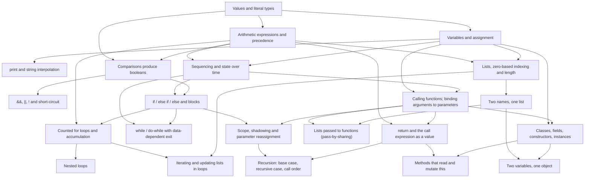

# Proposed prerequisite DAG for the CS1-through-Dart concepts

<!-- Generated by `dart run tool/report.dart`; edit `data/dag.yaml` instead. -->

A knowledge-space-style map: a node is available once every prerequisite has
been demonstrated (e.g. by answering its items). Nodes are finer than the ten
FCS1 concepts because the concepts are not atomic. Edges are **proposals** from
item analysis, not measured from student data; see the open questions at the
end.

## Graph

## Levels (longest prerequisite chain)

- **Level 0**: `values_and_types`
- **Level 1**: `arithmetic_expressions`, `variables_assignment`
- **Level 2**: `output_and_strings`, `sequencing`, `boolean_expressions`, `lists_indexing`
- **Level 3**: `logical_operators`, `selection`, `aliasing_references`, `function_calls_and_params`
- **Level 4**: `definite_loops`, `indefinite_loops`, `scope_and_shadowing`, `return_values`, `list_parameters`, `classes_and_objects`
- **Level 5**: `nested_loops`, `lists_iteration`, `recursion`, `methods_and_this`, `object_aliasing`

## Nodes

| Node | FCS1 concept | Prerequisites | Items | Rationale |
| --- | --- | --- | ---: | --- |
| `values_and_types` — Values and literal types | `fundamentals` | — | ⚠️ 0 | `3`, `3.5`, `'hi'`, `true` are different kinds of values. Everything else manipulates values, so this is the root. |
| `arithmetic_expressions` — Arithmetic expressions and precedence | `fundamentals` | `values_and_types` | 1 | `+ - * / ~/ %` and precedence. Needs the int/double distinction to make sense of `7 / 2` vs `7 ~/ 2`. |
| `variables_assignment` — Variables and assignment | `fundamentals` | `values_and_types` | 2 | A name holds a value; `=` replaces it. Must precede any expression that reads a variable. |
| `output_and_strings` — `print` and string interpolation | `fundamentals` | `variables_assignment` | ⚠️ 0 | Every tracing item is observed through `print`; interpolation `'$x'` is the Dart-specific syntax a student must read fluently before tracing. |
| `sequencing` — Sequencing and state over time | `fundamentals` | `variables_assignment`, `arithmetic_expressions` | 2 | Statements run top to bottom and a variable's value is whatever the most recent assignment left (the `a = b; b = a;` non-swap). This is the core skill behind all tracing. |
| `boolean_expressions` — Comparisons produce booleans | `logical_operators` | `arithmetic_expressions`, `values_and_types` | 1 | `x > 3` is a value of type `bool`, not a command. Required before any condition in `if` or a loop. |
| `logical_operators` — `&&`, `\|\|`, `!` and short-circuit | `logical_operators` | `boolean_expressions` | 3 | Combining booleans. Short-circuit evaluation additionally needs sequencing (which operand is evaluated first). |
| `selection` — `if` / `else if` / `else` and blocks | `selection` | `boolean_expressions`, `sequencing` | 4 | A chain runs one branch; independent `if`s may run several. Compound conditions (`&&`) are a co-requisite via `logical_operators`, not a prerequisite: simple `if (x > 3)` can be taught first. |
| `definite_loops` — Counted `for` loops and accumulation | `loops_definite` | `selection`, `arithmetic_expressions` | 4 | Needs a condition (from selection) plus the accumulator pattern (`total += i`). Off-by-one bounds are the main misconception probed. |
| `indefinite_loops` — `while` / `do-while` with data-dependent exit | `loops_indefinite` | `selection`, `sequencing` | 5 | Repetition guarded by a condition. Does not require `for` first; both loop forms hang off selection. `do-while` adds "body before test". |
| `nested_loops` — Nested loops | `loops_definite` | `definite_loops` | 1 | Inner loop runs to completion per outer iteration; trip count is a product or triangle number. Consistently harder than single loops. |
| `lists_indexing` — Lists, zero-based indexing and `length` | `arrays` | `variables_assignment`, `arithmetic_expressions` | 3 | `a[0]`, `a[a.length - 1]`, `a[i] = v`. Index arithmetic is why arithmetic_expressions is a prerequisite. |
| `lists_iteration` — Iterating and updating lists in loops | `arrays` | `lists_indexing`, `definite_loops` | 2 | Combines the index variable of a loop with element access; `for-in` is the Dart shortcut once the indexed form is understood. |
| `aliasing_references` — Two names, one list | `arrays` | `lists_indexing` | 1 | `var b = a; b[0] = 9;` changes what `a[0]` prints. First encounter with reference semantics; FCS1 probes it under arrays, Dart needs it again for objects and for list parameters. |
| `function_calls_and_params` — Calling functions; binding arguments to parameters | `function_params` | `sequencing`, `variables_assignment` | 2 | Arguments bind by position; parameters are fresh variables inside the call. Needs sequencing to follow control into and out of the call. |
| `scope_and_shadowing` — Scope, shadowing and parameter reassignment | `function_params` | `function_calls_and_params`, `selection` | 1 | A parameter named like a top-level variable is a different variable; reassigning it does not change the caller. Blocks (from selection) give the first notion of scope. |
| `return_values` — `return` and the call expression as a value | `function_return` | `function_calls_and_params`, `arithmetic_expressions` | 4 | The call `f(2)` *is* the returned value and can sit inside an expression; `return` exits immediately; `print` is not `return`. |
| `list_parameters` — Lists passed to functions (pass-by-sharing) | `function_params` | `aliasing_references`, `function_calls_and_params` | 1 | Mutating a list parameter is visible to the caller, reassigning it is not. Depends on both aliasing and parameter binding being secure. |
| `recursion` — Recursion: base case, recursive case, call order | `recursion` | `return_values`, `scope_and_shadowing` | 5 | Each call has its own parameter (scope) and hands a value back (return). Printing before vs after the recursive call is the ordering probe. Loops are deliberately *not* a prerequisite. |
| `classes_and_objects` — Classes, fields, constructors, instances | `oop` | `function_calls_and_params`, `variables_assignment` | 2 | A constructor call binds arguments to fields; each instance has its own field values. The field / parameter / local discrimination drill lives here. |
| `methods_and_this` — Methods that read and mutate `this` | `oop` | `classes_and_objects`, `return_values` | 1 | A method is a function with an implicit receiver; `this.count += 1` changes the object, a local `count` does not. |
| `object_aliasing` — Two variables, one object | `oop` | `classes_and_objects`, `aliasing_references` | 1 | Same misconception as list aliasing, now with fields; FCS1 OOP items lean on it. Placed after list aliasing because lists give a smaller mental model. |

## Open questions

- Every item carries a `dag_node:`; ⚠️ marks nodes with no evidence items
  yet (they can only be "passed" by their successors' items).
- `definite_loops` and `indefinite_loops` are siblings here. Curricula
  disagree; if `for-in` is taught first the `while` node could depend on it.
- `recursion` depends on `return_values` and scope but *not* on loops. That
  is a deliberate stance (recursion is not "a kind of loop") and should be
  validated against item data.
- `aliasing_references` is the first reference-semantics node and feeds three
  later nodes; if it proves too hard before functions, `list_parameters`
  could be where it is first introduced instead.
- The gap areas in `coverage.md` are not in the graph yet. Likely first
  additions: `types.nullable` (after `variables_assignment`), `expressions.maps`
  (after `lists_indexing`), `functions.optional_formals` (after
  `function_calls_and_params`), `patterns` (after `selection` + `records`).

